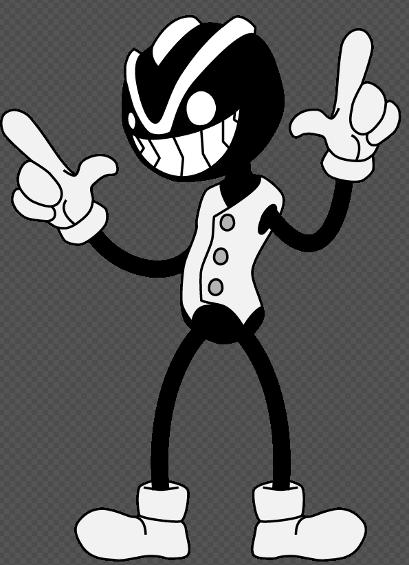
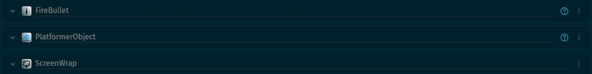
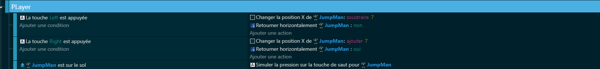
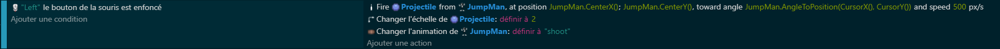
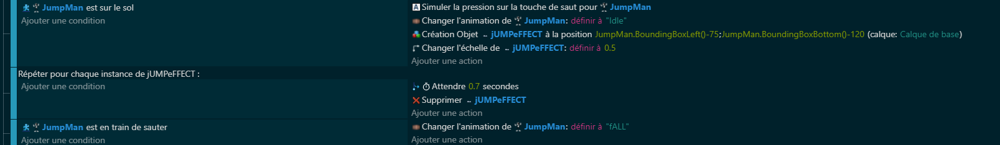

# 🕹 Chapitre 1: Le Player 🎮
## 🚀 Introduction
Dans ce premier chapitre, nous allons donner vie à notre personnage principal : le joueur. Il sera au cœur de notre jeu, et c'est lui que vous contrôlerez dans cette aventure ascendante 🌈. Vous apprendrez non seulement à le créer et à l'animer, mais aussi à le rendre interactif avec le monde qui l'entoure 🌍

## 🛠 Comportement
Le comportement du joueur est essentiel pour une expérience de jeu fluide et agréable. Dans notre jeu, le joueur pourra se déplacer de gauche à droite 🏃‍♂️, sauter 🕴, et tirer sur des obstacles ou ennemis 🔫.

- Déplacement et saut : Le joueur peut se déplacer horizontalement en appuyant sur les touches "Gauche" et "Droite" ⬅️➡️ et un appui sur la touche "Saut" permettra au joueur de s'élancer vers les hauteurs 🚀.
- Tir : En visant et cliquant, le joueur pourra tirer pour se défendre ou atteindre des cibles spécifiques 🎯.
- Screen Wrap : celui-ci servira à faire passer votre personnage à droite de l'écran quand il sera au bord à gauche de votre écran.

## 📝 Code
Passons à la pratique avec le code que tu as fourni 🧑‍💻. Le voici décortiqué :

- Déplacement et saut 🦘: Événements pour le déplacement gauche/droite et le saut. Utilise des conditions sur les touches pressées et simule un saut.
  
  
  
- Tir 💥: Événement pour le tir. Utilise la condition de clic de souris et tire un projectile avec une animation spécifique.
  
 

- Effets ✨: Événement pour créer un effet visuel lors du saut.
  
 

## 🎉 Conclusion
Félicitations ! Vous venez de réaliser la première étape dans la création de notre jeu type Doodle Jump 🥳. Avoir un personnage contrôlable est la base de tout bon jeu 🎲. Dans le prochain chapitre, nous plongerons dans le cœur de l'aventure avec la création de la map en procedural 🗺️. Préparez-vous à générer un monde sans limites 🚀 !

[Chapitre 2: La Map Procédurale](https://github.com/g404-code-gaming/Doodle-Jump-Like/blob/main/Création-Du-Jeu/2.Map%20Procédurale.md)
