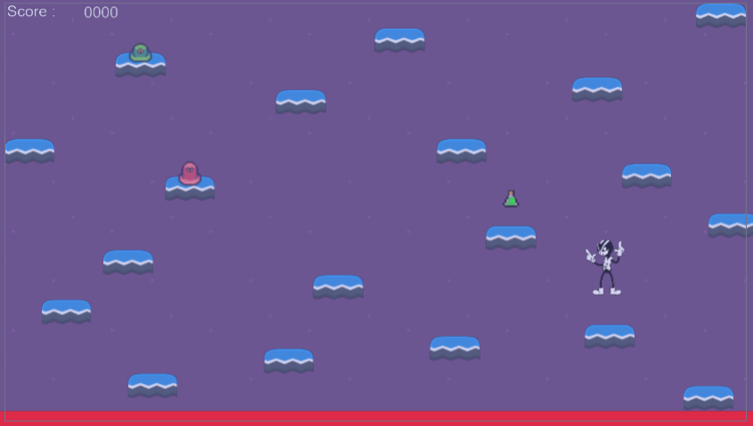
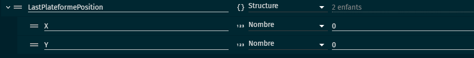
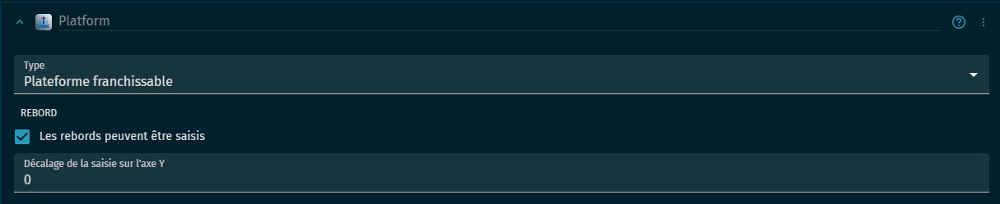
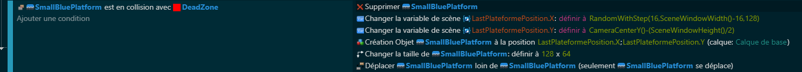

# 🗺️ Chapitre 2: La Map Procédurale
## 🌟 Introduction

La "map procédurale" ou "map générée procéduralement" est une technique qui permet de créer des cartes de jeu de manière dynamique, offrant ainsi une expérience unique à chaque partie 🎲. Au lieu de jouer sur une carte pré-définie, les éléments de la map sont créés sur le vif, selon des règles spécifiques. C'est un peu comme si à chaque partie, un nouveau monde s'ouvrait à vous 🌍. Des jeux célèbres comme "Minecraft" et "No Man's Sky" utilisent cette technologie pour offrir une infinité de possibilités d'exploration 🏝️.

## 🌍 LevelDesign
Crée seulement la première partie de votre map disposez un peu de partout des plateformes, votre personnage en point de départ et une dead zone rouge que vous placerez tout en bas de votre écran pour tuer votre personnage s'il tombe trop bas.

## 🔄 Variables et Comportements
Pour créer notre propre univers procédural, nous devons d'abord comprendre les variables et comportements clés 🗝️:

### Variables de scène
La structures LastPlateformePosition : Elles vont stocker des informations importantes comme la position des prochaines plateformes c'est a dire deux enfant X et Y 📊.

Comportements : Afin de ne pas passez au travers des platforme on ajouteras sur nos plateforme le comportement "Platform" 🛤️.

## 💻 Code
### 🎥 Gestion de la Caméra
Pour une expérience utilisateur fluide, le contrôle de la caméra est essentiel, surtout dans un jeu de plateforme ascendant comme le nôtre. Voici comment nous allons procéder :

Tout d'abord, parlons d'une fonction importante dans le jeu vidéo La Linear Interpolation, souvent abrégée en Lerp, est une technique fondamentale en programmation de jeux vidéo 🎮. Elle sert à calculer des transitions douces entre deux valeurs sur une certaine période. Imagine que ton personnage se téléporte d'un point A à un point B instantanément, ce serait assez abrupt, n'est-ce pas ? Le Lerp permet de rendre ce mouvement plus fluide, comme s'il se déplaçait physiquement de A à B en un temps défini 🏃‍♂️💨.

### 🌍 Génération de Plateformes Procédurales
Maintenant, passons à la création du cœur de notre map procédurale - les plateformes. Celles-ci doivent apparaître de manière aléatoire mais cohérente, pour offrir un challenge tout en restant jouable :

### 🌍 DeadZone
Nous allons tuer notre personnage afin de créer un risque pour donner du stress au joueur pour qu'il ne tombe pas des plateformes.

## 🎉 Conclusion
Et voilà ! Vous avez franchi un pas de géant en créant un univers infini pour votre jeu 🌌. La génération procédurale ouvre la porte à des aventures sans fin, rendant chaque partie unique ✨. Le prochain chapitre nous plongera dans un autre aspect crucial de notre jeu : les ennemis 👾. Préparez-vous à ajouter du piquant à cette aventure infinie !

[Chapitre 3: Les Ennemis - L'Armée de Slimes](https://github.com/g404-code-gaming/Doodle-Jump-Like/blob/main/Création-Du-Jeu/3.Ennemis.md)
