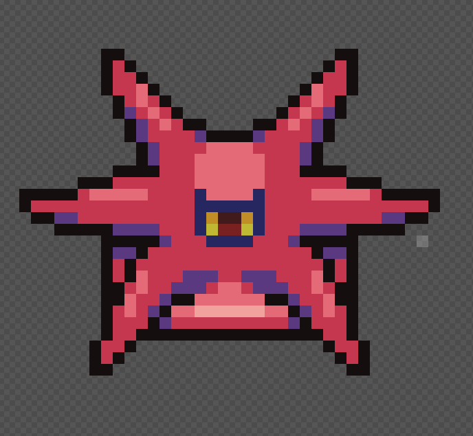
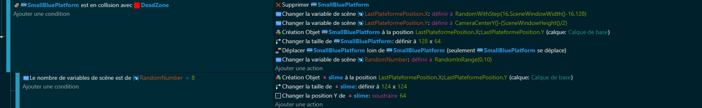
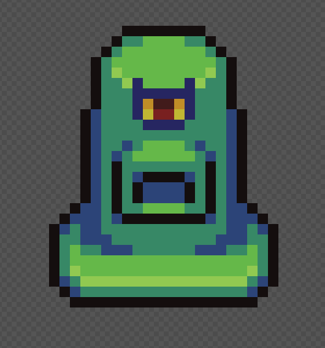
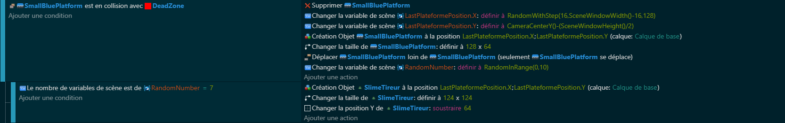
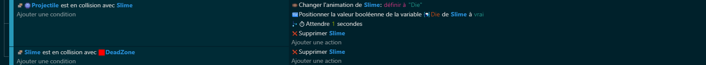

# 👾 Chapitre 3: Les Ennemis - L'Armée de Slimes

## Introduction
Dans ce chapitre crucial, on va se concentrer sur la création de deux types distincts d'ennemis : le slime à piques 🌵 et le slime tireur 🔫. Mais cette fois, il y a un twist ! On va les considérer comme faisant partie d'une même et grande famille : les slimes 💚. Cette approche nous permettra de simplifier certaines interactions et de poser les bases pour des stratégies de groupe plus complexes. On commencera par explorer comment créer et gérer chaque ennemi individuellement avant de les unir sous une même bannière.

## Création et Gestion Individuelle des Slimes 🛠️
### Le Slime à Piques 🌵
On introduit d'abord notre slime piquant. Ce petit gars est plus qu'un obstacle sur votre chemin ; c'est la première de nos menaces glissantes.

#### Comportement et Variable Individuel 🎭
C'est un gardien redoutable. Sauter sur lui ? Mauvaise idée ! Il va falloir faire preuve d'inventivité pour le contourner.

Die : Cette variable nous servira à activer son animation de mort quand notre personnage tirera sur ce slime

#### Code de Création et d'Interaction 💻

### Le Slime Tireur 🔫
Place maintenant à notre slime équipé d'un canon. Il ne se contente pas de bloquer le passage ; il le défend !

#### Comportement et Variable Individuel 🎯

Reste sur tes gardes. Son approche nécessite réflexe et agilité pour esquiver ses tirs mortels.

Pour ajouter cette fonctionnalité de tire mortelle. Rien de plus simple ! Il te suffit de rajouter le comportement de tir appelé "FireBullet" et de choisir le nombre balle tirée par seconde.

Die : Cette variable nous servira à activer son animation de mort quand notre personnage tirera sur ce slime.

#### Code de Création et d'Interaction 💻
##### Code de tir

##### Code de création

### Gestion en Groupe des Slimes 🤝
Après les avoir introduits individuellement, il est temps de les réunir. La force de l'union fera de nos slimes une menace bien plus grande.

#### Code de Gestion de Groupe 💻

##### Tuer nos Slimes

##### Etourdir notre Player 

🚀👾 Conclusion 🎖️✨
Bravo, tu viens d'étendre ton armée d'ennemis et de jeter les bases pour des interactions plus complexes et stratégiques ! Chaque slime, à sa manière, contribue à enrichir l'expérience de jeu. La création de ces menaces, joliment regroupées sous le nom de "slimes", ouvre un éventail de possibilités pour des défis encore plus captivants 🧩👻. Mais ce n'est que le début, car gérer une armée nécessite stratégie et finesse. Prépare-toi pour le prochain chapitre où l'aventure devient encore plus électrisante !

[Chapitre 4: Le Score + Power-ups](https://github.com/g404-code-gaming/Doodle-Jump-Like/blob/main/Création-Du-Jeu/4.Le%20Score%20%2B%20Power-ups.md)
