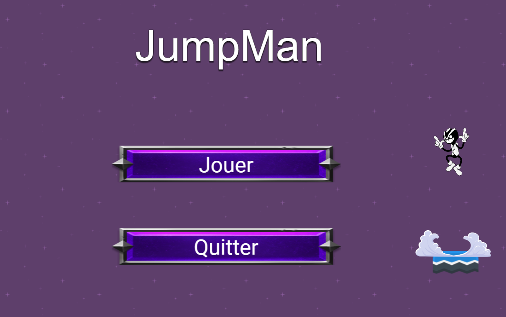
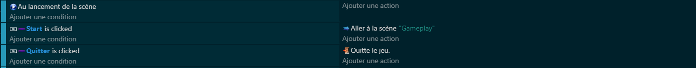
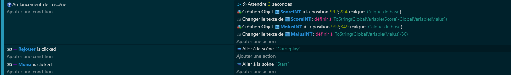

# 🏁 Chapitre 5: Menus - Principal et de Fin
Le voyage dans la création de notre jeu ne serait pas complet sans un bon début et une belle conclusion. Le menu principal 🌟 offre la porte d'entrée vers l'aventure, tandis que le menu de fin 🏆 clôture l'expérience, avec une touche personnelle: le score final.

## Menu Principal 👾
Le menu principal est le premier contact du joueur avec ton jeu. Il doit être accueillant, intuitif et directement plonger le joueur dans l'ambiance.

### Fonctionnement 🛠️
Un écran simple mais accrocheur, avec le titre du jeu ✨.
Des options claires pour commencer à jouer ▶️, ou quitter le jeu 🚪.

### Code pour le Menu Principal 💻

## Menu de Fin 🏆
Après l'effort, le réconfort. Le menu de fin est là pour féliciter le joueur, lui montrer son score et l'inviter à recommencer ou à quitter.

### Fonctionnement 🛠️
Affichage du score final pour récompenser les efforts 🎖️.
Options pour rejouer 🔄 ou quitter le jeu 🚪, afin de donner au joueur le choix de sa prochaine action.

### Code pour le Menu de Fin 💻

## 🚀🏆 Conclusion Finale 🌌✨
Et voilà, ton jeu est désormais doté d'un début et d'une fin dignes de ce nom, prêts à inviter et à féliciter les joueurs pour leurs aventures. Ce chapitre conclut notre création ensemble, mais je suis sûr que c'est juste le début pour toi et tes futurs projets de jeux 🌠.
